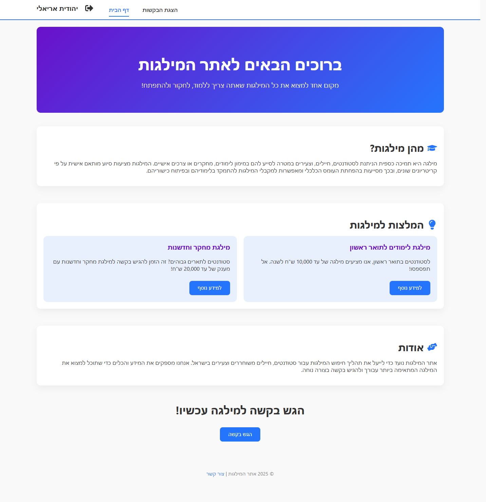
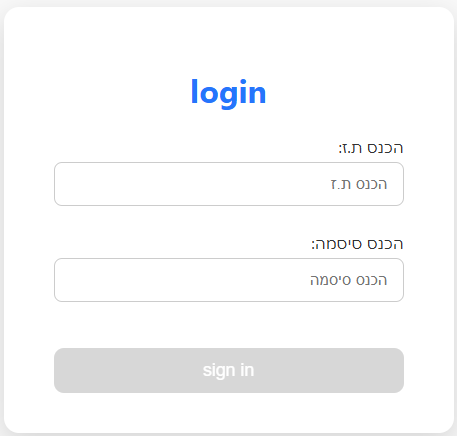
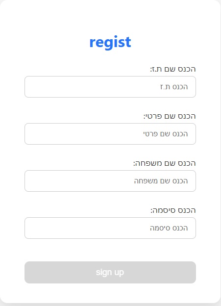
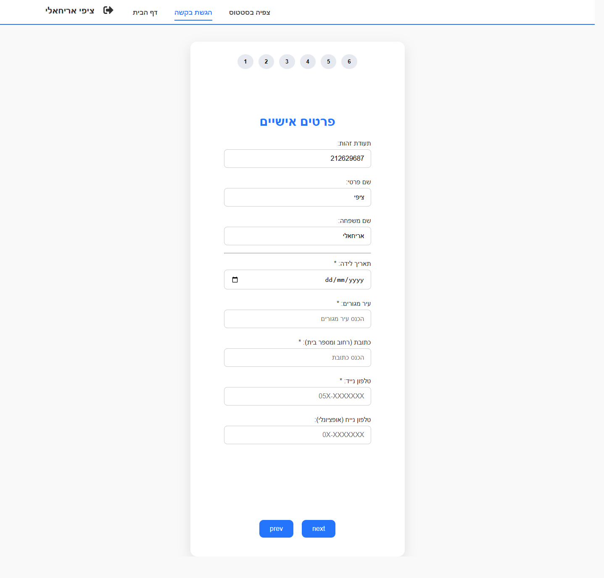
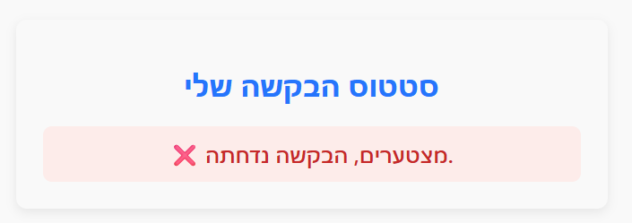
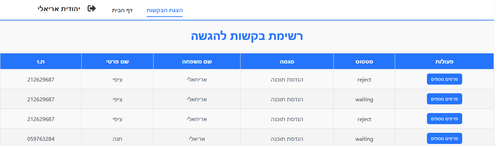
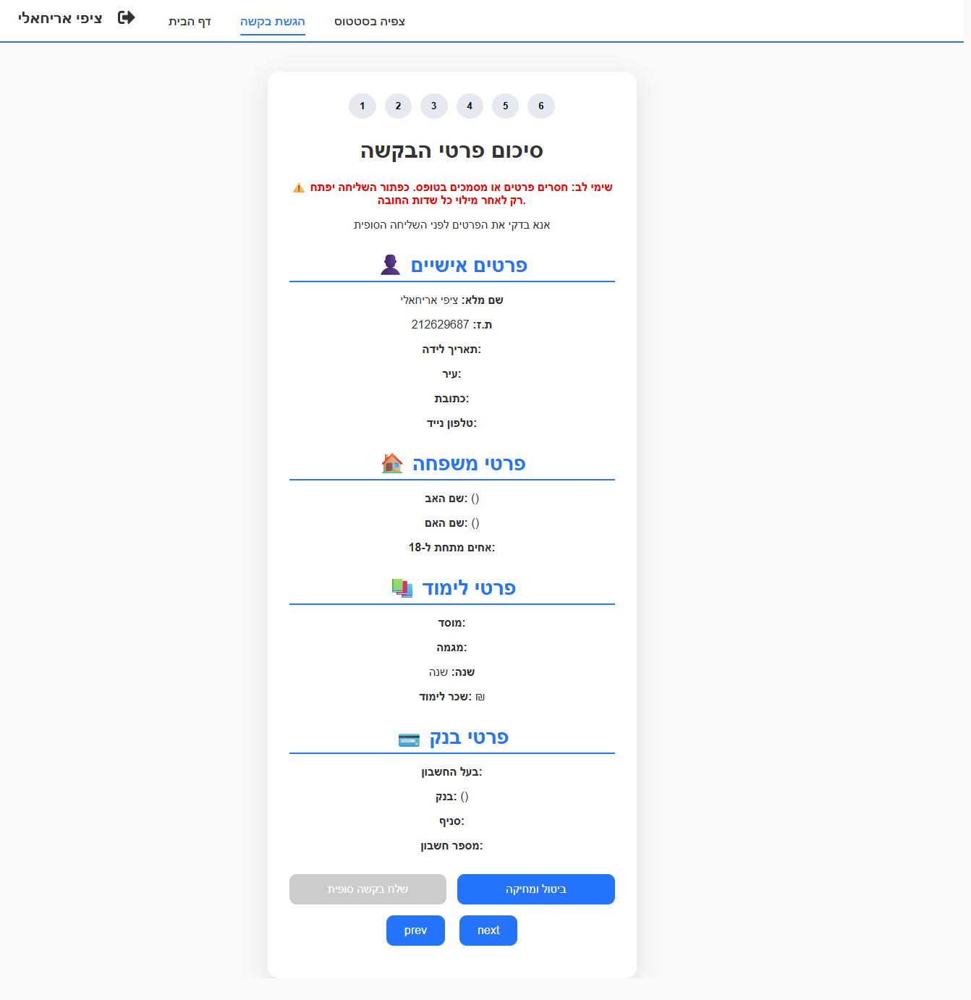

# 🎓 Student Scholarship Management System (MERN Stack)

A Full-Stack system for managing scholarship applications, built with React, Node.js, and MongoDB. Allows students to submit applications via a multi-step form and enables administrators to review, approve, or reject applications in real-time.

---

## 🌟 Key Features

### 👤 Student Side
- **Authentication:** Secure login and registration.
- **Multi-Step Application Form:** 5 steps capturing personal, family, academic, and bank details.
- **Document Upload:** Upload tuition receipts, ID copies, and other required documents.
- **Dashboard:** Track status of applications (Pending / Approved / Rejected).

### ⚙️ Admin Side
- **Applications Overview:** Central table with all submitted applications.
- **Detailed View:** Inspect full student information and uploaded documents.
- **Approve/Reject:** Quick one-click actions to update student status.
- **Filtering:** Search and filter by name, ID, status, income, number of siblings, etc.

---

## 💻 Tech Stack
- **Frontend:** React.js, Axios, CSS Modules / Styled Components
- **Backend:** Node.js, Express.js
- **Database:** MongoDB (Mongoose)
- **File Uploads:** Multer
- **Security:** JWT authentication

---

## 📂 Project Structure

```text
client/          # React frontend
server/          # Node.js backend
│   ├── models/      # MongoDB schemas
│   ├── routes/      # API endpoints
│   ├── controllers/ # Logic for admin and student actions
│   └── uploads/     # Uploaded documents
└── README.md

## 📸 Screenshots

### Home Page


### Login


### Registration


### Application Form


### Status Page


### Admin Requests


### Application Details

## 🌐 Live Demo
🔗 [View Live Project](https://your-live-demo-link.com)

## 👩‍💻 Developer

**Yehudit Arieli** – Full-Stack MERN Developer  
✉ [Email](mailto:your-email@example.com)

## 🎯 Motivation

This project simulates a real-world scholarship system with role-based workflows, multi-step forms, secure authentication, and complex admin management.
